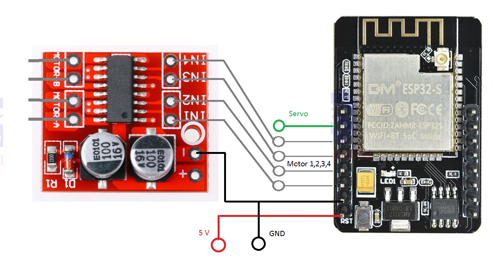
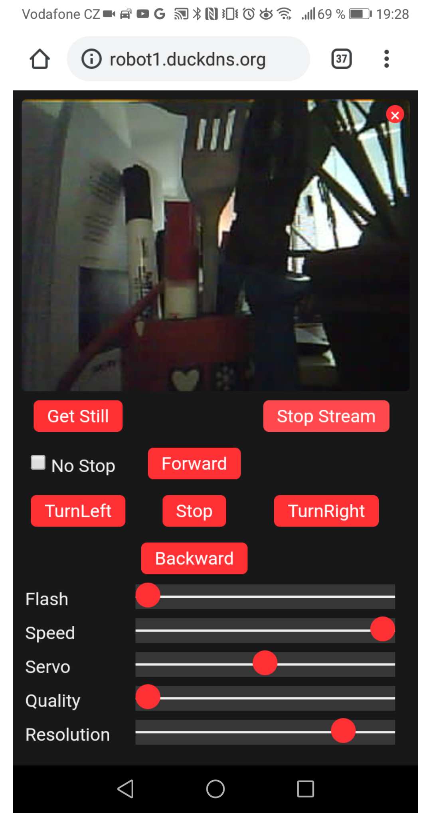
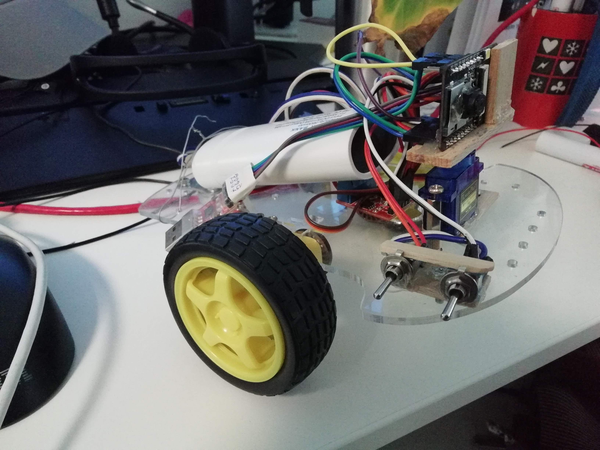
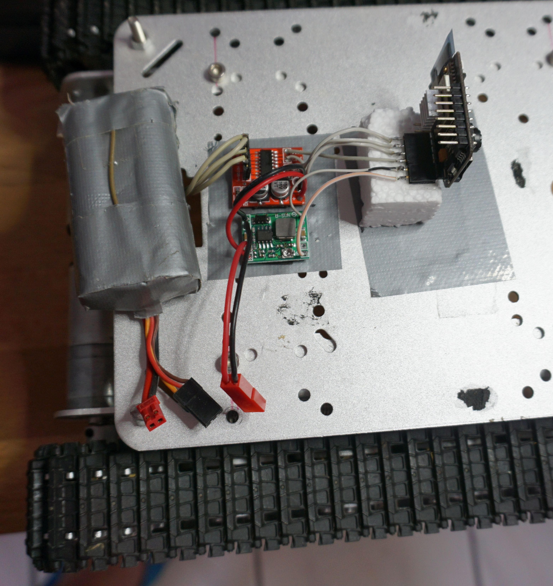
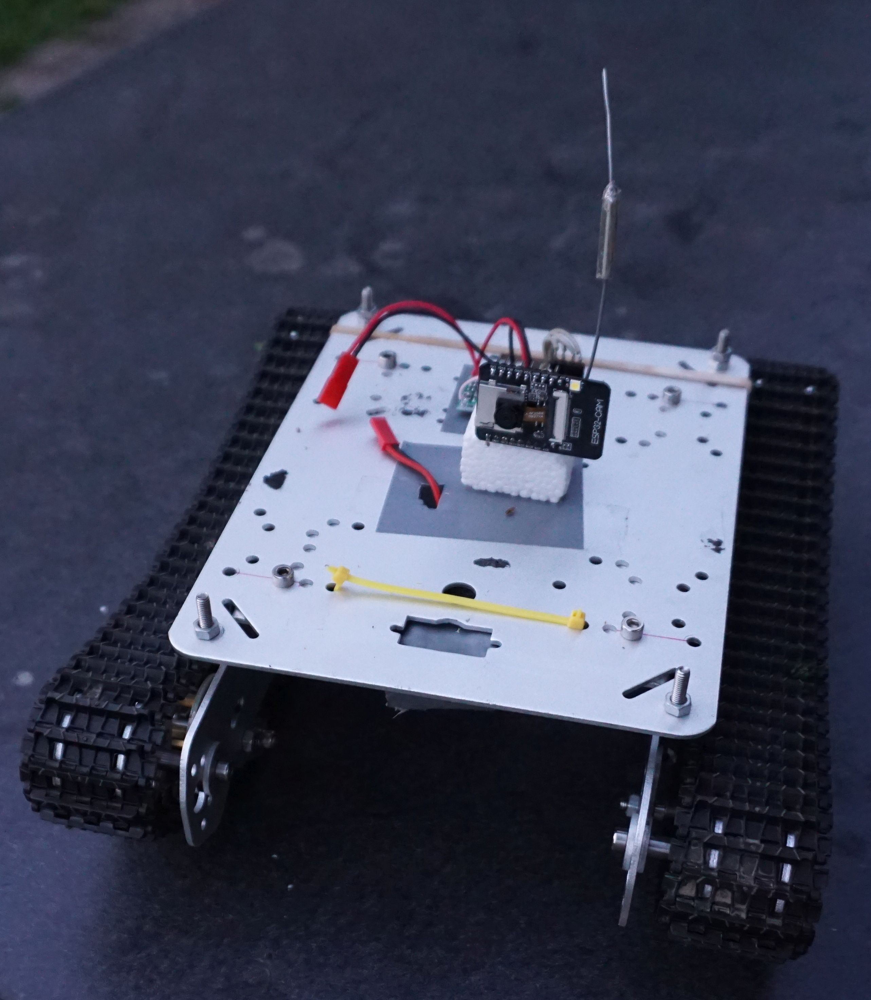

# ESP32-CAM_TANK

This is fork of PepeTheFroggie's project [https://github.com/PepeTheFroggie/ESP32CAM_RCTANK]("ESP32CAM_RCTANK") which is a nice starting example for ESP32 CAM projects.
IP connected tank is controlled from web browser. One can see where the tank is heading as it streams the video from the camera directly to web browser. Servo can be used for further pointing the camera and user can control amount of light emited by LED on the ESP32 CAM board.

This fork of the project aims to add some more features as listed below.

- Dynamic IP address of ESP32-CAM is posted at the start-up to the dynamic DNS server (DuckDNS). This permits to point the browser to always the same symbolic IP. The dynamic IP address is frequently different when reconnecting. One has to connect to serial port of the gadget to get it which is not convenient.

- The ESP-CAM reports the status of connection by blinking its LED. It is blinking in two bursts. 
   - The first burst: 1 blink - conected to wifi, 2 blinks - switched to soft access point mode (user can still connect to ESP32-CAM as it runs its own access point).
   - The second burst: 1 blink- IP sent to DynamicDHCP, 2 blinks- sending to DynamicDHCP was not configured, 3 blinks - sending of IP address failed.

## Wiring:

## Compilation 
Please make sure that you have either selected ESP32 Wrover Module or another board which has PSRAM enabled in Arduino IDE.

Rename tempate_secrates.h. to secrates.h and fill in your MY_SSID and MY_PASSWORD of your wifi. If there is no password required , write NULL instead (without quotes)

If you want to be able to refer to your ESP32CAM by symbolic name, register at https://www.duckdns.org service and select name of the service. Fill in API key to MY_DUCKDNS_TOKEN and name to MY_DUCKDNS_NAME in secrates.h

## Browser screen-shot:

## Build (remake and original):

## Video:
[https://youtu.be/qUAGnk382mc](https://youtu.be/qUAGnk382mc)
